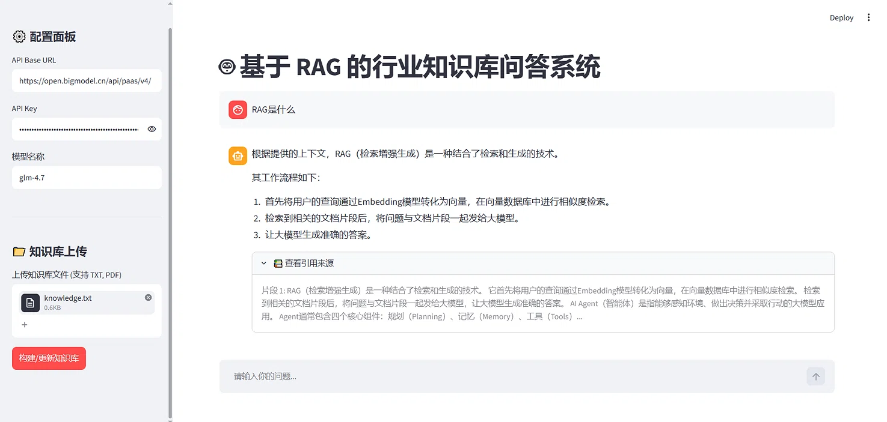

# 基于 RAG 的行业知识库问答系统 (个人测试项目)

## 📖 项目简介
这是一个基于 RAG（检索增强生成）技术的个人测试项目。旨在解决大模型在垂直领域回答问题时的“幻觉”问题，通过外挂本地知识库，让大模型能够基于用户的私有文档（TXT/PDF）进行准确作答，并支持答案的引用溯源。

## ✨ 主要功能
- **多格式文档支持**：支持上传 TXT 和 PDF 文件，自动进行文本切分。
- **本地向量化**：使用 `BAAI/bge-small-zh-v1.5` 模型进行 Embedding，无需依赖外部 API。
- **RAG 检索增强**：基于 FAISS 向量数据库的相似度检索，结合 LangChain 提示词模板，生成准确答案。
- **多轮对话记忆**：支持上下文理解，能够根据历史对话进行多轮追问。
- **引用来源溯源**：回答下方可展开查看检索到的原始文档片段，提升答案可信度。
- **Streamlit 可视化界面**：提供友好的 Web 交互界面。

## 🚀 快速开始

### 1. 克隆项目
```bash
git clone https://github.com/Lg-jy-co/RAGDemo.git
cd RAGDemo
```

### 2. 安装依赖
```bash
pip install -r requirements.txt
```

### 3. 下载本地向量模型（解决国内网络下载失败问题）
本项目强制使用本地 Embedding 模型。请执行以下命令将模型下载到项目根目录：

#### Windows (Terminal/终端):
```powershell
pip install huggingface_hub
$env:HF_HUB_DISABLE_XET=1
$env:HF_ENDPOINT="https://hf-mirror.com"
hf download BAAI/bge-small-zh-v1.5 --local-dir bge-small-zh
```

#### Mac / Linux:
```bash
pip install huggingface_hub
export HF_HUB_DISABLE_XET=1
export HF_ENDPOINT="https://hf-mirror.com"
hf download BAAI/bge-small-zh-v1.5 --local-dir bge-small-zh
```
> #### ⚠️ 备用方案：如果上述命令依然因为网络问题卡住（Xet 401错误），推荐使用阿里魔搭下载：
>   ```bash
>   pip install modelscope
>   modelscope download --model BAAI/bge-small-zh-v1.5 --local_dir bge-small-zh
>   ```


### 4. 配置API Key
将`config.example.json`重命名为`config.json`，并填入你的智谱 API Key（或其他兼容 OpenAI 格式的 API）

### 5. 启动应用
```bash
streamlit run app_demo.py
```

在浏览器中打开`http://localhost:8501`，上传`knowledge.txt`，点击“构建/更新知识库”，即可开始问答！

## 📸 测试截图


## ⚠️ 声明
本项目为个人学习与测试项目，用于验证 RAG 流程的工程可行性，仍在持续完善中。